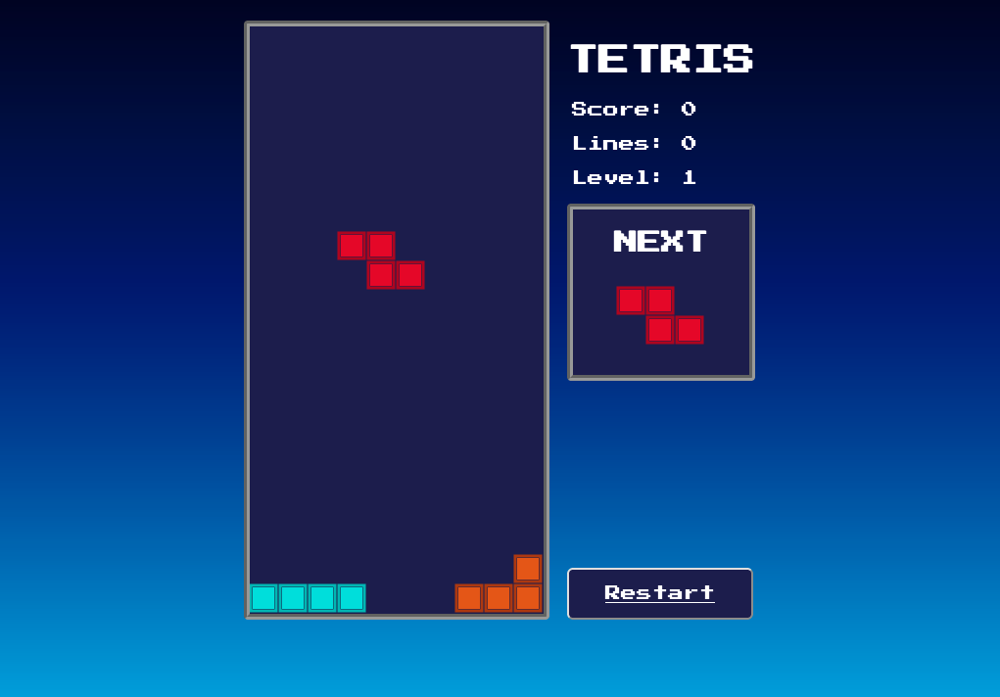

# Vue Tetris

Simplified version of Tetris build in Vue 3

## Installation

Once cloned simple run `npm install && npm run build` then simply run `./dist/index.html` in your browser.

## Controls

⬅️ move left

➡️ move right

⬆️ rotate

⬇️ slam down

